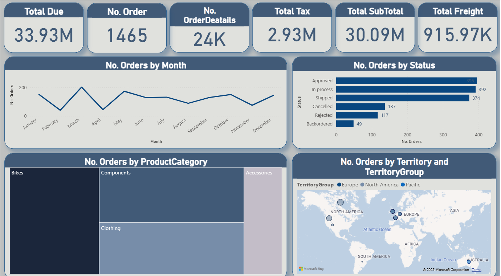
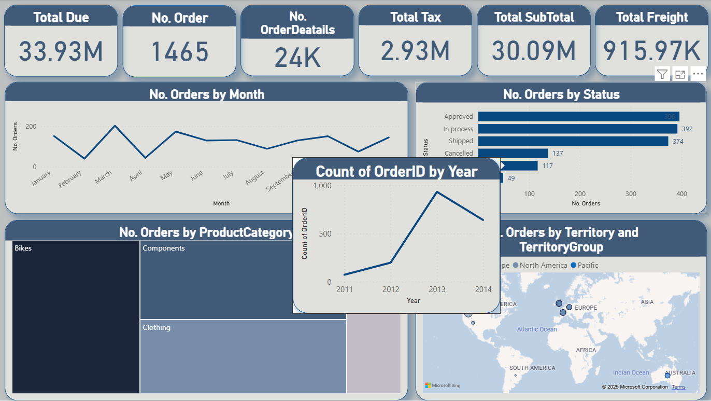

# 🟡 Power BI – Global Sales Performance Dashboard  

### 📘 Project Overview  
This project focuses on analyzing **global sales performance** across multiple regions, product categories, and time periods.  
It was developed as part of my BI portfolio to demonstrate how complex datasets can be transformed into **clear, interactive, and decision-ready insights** using Power BI.  

The main objective was to design a **single source of truth** that allows business users to track KPIs, identify opportunities, and take data-driven actions efficiently.  

---

### ⚠️ Business Challenge  
The company struggled to get a consolidated view of global performance.  
Sales data existed in different regions and product files, making it difficult to understand:  
- Which regions were driving revenue  
- Which categories performed best  
- How order efficiency compared across locations  

As a result, leadership teams lacked clarity when planning inventory, forecasting demand, and allocating marketing budgets.  

---

### 💡 Approach  
- Transformed and cleaned raw data using **Power Query**.  
- Built a **relational data model** connecting Orders, Products, and Territories in **Power BI**.  
- Created DAX measures for **Total Due**, **Freight**, **Tax**, and **Order Count**.  
- Designed an interactive dashboard with **filters, slicers, and dynamic tooltips**.  
- Focused on a clean and intuitive layout that blends **high-level KPIs** with **deep-dive insights**.  

---

### 🖼️ Dashboard Overview  

The **Global Sales Performance Dashboard** delivers a unified view of company sales across all markets.  
It allows decision-makers to easily monitor key metrics, explore trends by region or product, and uncover hidden patterns in the data.  

  
  

> 💡 The dashboard combines simplicity and interactivity — giving every stakeholder the power to explore data, not just read it.  

---

### 📊 Key Insights  
- **$33.9M Total Due** recorded from **1.4K orders** — strong operational performance.  
- **Bikes** emerged as the highest-revenue category.  
- **Europe** and **North America** led in both order volume and total revenue.  
- Over **80%** of orders were *Approved* or *In Process*, indicating solid operational efficiency.  
- **2013** marked the historical sales peak — a valuable benchmark for future analysis.  

---

### ✅ Recommendations  
1. Strengthen marketing and distribution in **Europe & North America** to maintain momentum.  
2. Expand the **Bikes** product line to capitalize on consistent demand.  
3. Investigate order delays in slower regions to identify workflow improvements.  
4. Use **2013** as a baseline for **year-over-year growth modeling**.  

---

### 🧰 Tools Used  
- **Power BI** – Dashboard creation and visualization  
- **Power Query** – Data cleaning and transformation  
- **DAX** – Calculated measures and KPIs  
- **Excel** – Initial data exploration and structure review  
- **Map Visuals** & **Dynamic Tooltips** – Interactive insights  

---

### 🖥️ Interactive Dashboard  

Explore the full interactive version of the **Global Sales Performance Dashboard** to see filters, slicers, and tooltips in action.  

📊 **Live Dashboard:** [**View on NovyPro →**](https://project.novypro.com/aiM7Mw)  

> 💡 Hover over visuals to explore detailed regional performance, product-level metrics, and order statuses.  

---

### 👤 Author  
**Raafat Elrais**  
Business Intelligence Developer  

📍 Connect with me on LinkedIn: [Raafat Elrais](https://www.linkedin.com/in/raafat-elrais/)  

💡 I’m #OpenToWork — always open to collaborations and opportunities in **Data Analysis, BI, and Data Visualization**.  
